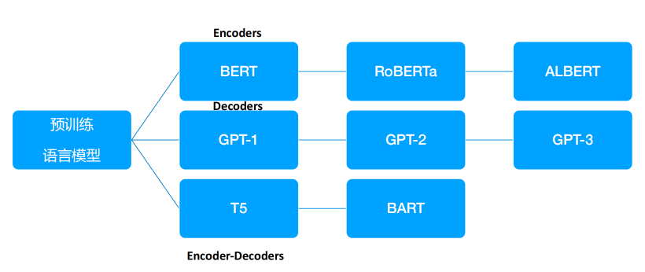

# ai

## 1. 基础

### 1.1. transfermer（神经网络中的一个分支, 训练模型）
Transformer是一种革命性的深度学习模型架构，通过注意力机制和多层堆叠的方式，显著提高了处理序列数据任务的能力和效率

提出RNN更好的一种架构

+ Encoder/Decoder
+ attention

 
### 1.2. 大模型
#### 1.2.1 BERT
使用深度的transfermer

+ 对上下文理解能力强

#### 1.2.2 GPT

+ 根据上文给出下文

GPT1 --> 增加了多个transfermer
GPT2 --> 喂更多数据
GPT3 --> 喂更多数据，增加爬虫获取网络数据，数据加载需要更多的GPU所以使用in-context learning上下文，使用了prompt
in-context learning其实就是给一个示例让参考执行
GPT3.5 --> 与人对话，人类的反馈
GPT4 --> 

为什么优秀
+ 预训练pre-trained
+ 指令微调instruction-tuning 针对特定任务标注数据进行微调


#### 1.2.3 预训练语言模型三种网络架构
+ Encoders --> BERT
+ Decoders -->GPT
+ Encoders-Decoders --> T5/BART



### 1.3. prompt
提示词，优化提示词可以使用大模型时收费少

+ Cot 思维链chain-of-thought prompting --> 允许模型将多步问题分解为中间步骤
+ self-consistency 多路径推理，提升Cot性能 --> 三个60%加起来效果可能超过一个80%
+ ToT 思维树 Tree-of-Thoughts


### 1.4. Enbedding 嵌入
向量

+ representation learning 表示学习
  - DNN 深度神经网络

直观的理解：
 text --> embedding model --> text as vaector (比如 0.000 0.006...)


### 1.5. 向量数据库
苹果-->各种特征-->[11, 22, ...]数组， 向量数据

传统数据库--> 行列分析
向量数据库--> 非结构化数据， 根据权重输出结果


### 1.6. openAI开发
### 1.6.1. openAI提供的大模型
+ Embeddings
+ GPT-4
+ GPT-3.5
+ GPT-3
+ Moderation 分类模型
+ Deprecated 探测文本是不敏感违规

### 1.6.2. Token大小与计费
计算一段话中包含多少个token，比如750个单词中有35个Token, Token视为单词的组成部分

+ tiktoken openai提供的token的包，一种BPE分词器

接口调用返回体会描述token数量
"usage":{
	"completion_tokens": 17, // output返回结果中token
	"prompt_tokens": 57, // input输入中token
	"total_tokens": 74 // 总共的token数量
}


### 1.6.3. api
以http接口提供

查看有那些模型
GET https://api.openai.com/v1/models   查看有哪些模型


### 1.6.4. message(其实就是prompt)
GPT-3.5之后是对话的方式，所以为message

角色：
+ system 设定一个身份，比如你是一个有用的助手
+ user 你，提问题的人
+ assistant 回答你问题的

### 1.6.5. 上下文
就是上面回答问题放在一个数组中，即历史消息也知道


### 1.6.6. tiktoken 
openai提供的token的包，一种BPE分词器


编码，不同的编码会有不同的token,有以下三种编码
+ cl100k_base
+ p50k_base
+ r50k_base/gpt2

获取模型的编码
encoding= tiktoken.encoding_for_modle('gpt-3.5-turbo')


+ openAI模型实践：https://platform.openai.com/playground/chat?models=gpt-3.5-turbo-0125


### 1.6.7. function calling
调用外部的一些功能


### 1.6.7. 实战技巧
+ 角色设定
+ 指令注入： system设置比如"主题创作"
+ 问题拆解：复杂问题拆分多个子问题
+ 分层设计：创作长篇内容，先章节在补充细节，如：小说生成
+ 编程思维：prompt当成编程语言，主动设计模板和正文， 如：评估模型输出质量
+ Few-shot: 基于样例设计prompt，规范推理路径和输出样式，如：构造训练数据


### 1.6.8. 实战项目
1、translator 翻译


---------------------------

### RAG 检索增强
Retrieval Augmented Generation ，意为检索增强生成


### agent
做决策使用


----------------------

## 2. 开发
### 2.1. dify
是一个开源 LLM 应用开发平台。使用 RAG 引擎编排从代理到复杂 AI 工作流的 LLM 应用

### 2.2. longchain
大语言的开发框架,是一个middle层


#### 实战
```python
# 安装
pip3 install langchain


```

文章总结参考资料：
+ 教程：https://langchain114.com/docs/use_cases/summarization/
+ 总结讲解：https://juejin.cn/post/7238110426147504184
+ docs总结例子：https://www.python-engineer.com/posts/langchain-crash-course/
+ fastapi: https://fastapi.tiangolo.com/zh/tutorial/body/

### 2.3. ollama
go开发本地大语言模型运行框架


资料：
+ 教程（非常好）：https://github.com/DjangoPeng/openai-quickstart

+ 个人简单笔记 https://wiki.eryajf.net/pages/97047e/#%E5%89%8D%E8%A8%80
+ langchain总结 https://langchain114.com/docs/use_cases/summarization/

+ 一个基于grop+Llama3生成书籍的 https://github.com/Bklieger/groqbook 


+ 一个实现：https://github.com/CopilotKit/CopilotKit  

+ 别人的langchain学习笔记 https://juejin.cn/user/3125246096841600/posts
+ langchain教程 https://liaokong.gitbook.io/llm-kai-fa-jiao-cheng#chain-lian

