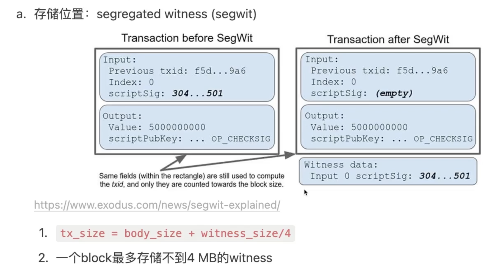

# bitcoin

## 1.1 基础

+ 比特币全节点下载
  - https://bitcoincore.org/en/download/

+ 查看比特币容量大小
  - https://blockchain.com/explorer  

+ 比特币钱包
  - https://bitcoin.org/

+ 测试网络水龙头
  - https://coinfaucet.eu/en/btc-testnet/
  - https://signetfaucet.com/  signet网络的

+ 浏览器
  - https://mempool.space/

```text
signet=1
#testnet=1
txindex=1
#testnet=1

[test]
#server=1
#rpcuser=user
#rpcpassword=password
#rpcallowip=127.0.0.1
#rpcport=8332

[signet]
server=1
rpcuser=user
rpcpassword=password
rpcallowip=0.0.0.0/0
rpcport=8332
```


## 1.2 隔离见证SegWit
对比特币进行软分叉，及对原来的块进行扩容

原来只能存储1M，扩容后最大可以存储4M，后面可以进行nft存储，一个图片可以在4M以内

+ P2WSH Pay-to-Witness-Script-Hash
+ P2WPKH Pay-to-Witness-Public-Key-Hash

## 1.3 闪电网络
就是bitcoin二层网络
+ peer
+ channel

peer之前的通过channel进行转账，最后将交易回传到比特币主网，即闪电网络中进行多笔交易，将最后的结果回传到主网即一笔交易

## 1.4 nft--Ordinals
1btc=10^8sat 聪

+ 对sat进行排序
+ 存储格式Taproot


交易代码：https://github.com/VincentDebug/go-ord-tx  


PSBT可以实现去中心化markplace


## 1.5 brc-20
brc20是借助ordinals协议铭刻json数据，只定义了部署 铸造和转账行为
brc20代币的持有状态由链下维护
```text
{  
"p": "brc-20",//Protocol: 帮助线下的记账系统识别和处理brc-20事件  
"op": "deploy",//op 操作: 事件类型 (Deploy, Mint, Transfer)  
"tick": "ordi", //Ticker: brc-20代币的标识符，长度为4个字母（可以是emoji） 
"max": "21000000",//Max supply: brc-20代币的最大供应量  
"lim": "1000"//Mint limit: 每次brc-20代币铸造量的限制
}
```

需要一些indexer去支持，目前都是自己实现，官方没有  
参考：https://github.com/unisat-wallet/libbrc20-indexer  


## 1.6 bitvm


## 1.7 rgb
链下做资产转移，链上做状态变更


## 1.8 taproot
使用Schnorr签名和Merkle树等技术，提高比特币交易的隐私性 安全性和可扩展性
Taproot可以让复杂的交易(多签、时间锁)像单个比特币交易那样执行

### 1.8.1 taproot升级主要内容
+ P2SH
+ MAST
+ schnorr签名

#### 1.8.1.1 P2SH
bitcoin两大标准
+ Pay-to-PubKeyHash(P2PKH) -- 公钥hash+私钥解锁UTXO
+ Pay-to-ScriptHash(P2SH) -- 提供解锁脚本解锁脚本中的UTXO


#### 1.8.1.2 MAST默克尔抽象语法树 


## 1.9 stacks bitcoin二层网络
将bitcoin锚定在自己链上，来通过获取stx自己的代币来获取bitcoin收益，不能算真正意义上的bitcoin二层网络
只是强制将自己的链和bitcoin关联起来


## 1.10 Discreet Log Contracts谨慎日志合约

+ Schnorr 签名  
  - 基于离散对数问题的数字签名方案

alice:  
PubAi ∨ (PubB ∧ TimeDelay)  
个人理解：  
alcie和bob 共同生成一笔交易各自存1btc，发送到bitcoin上，取钱需要两个人的签名  
上面的公式 PubAi = pubA + S(预言机生成的加密结果)，这个交易放在链下，等结果公布了发布到链上，如果alice赢了，他可以发送交易取回赢得，bob与其类似  


### 1.10.1 chain.link

### 1.10.2 rust-dlc
```text
编译sample报错openssl
解决：

```

## 1.11 Oracle预言机


## 1.12 ordinals协议
链上的一笔交易：
https://mempool.space/zh/tx/cee1201a981420aecf125917a2a8a14544fbf70b926c0e5f6d58db363db1a605

## 1.13 runes协议


## 1.14 PSBT 
将交易拆分


## 1.15 脚本原理
+ 脚本原理：https://happypeter.github.io/binfo/bitcoin-scripts
+ 脚本的一些例子：https://zhuanlan.zhihu.com/p/257848202
+ 脚本说明：https://github.com/tianmingyun/MasterBitcoin2CN/blob/master/ch07.md
+ btc地址以及ordinals：http://defiplot.com/blog/ordinal-inscriptions-detailed-explanation/

## 1.16. btc地址生成
+ https://mirror.xyz/imsongoku.eth/-aMTAIyj8X25QQ2cZf9uvuwTU8uD6CjlpRwGc2AuT3E

## 1.17. OP_RETURN
+ 参考代码：https://gist.github.com/ryandotsmith/e9b82473994c8b7bc0fc

## 1.18. 未解决概念
+ 门限签名，私钥分片 mpc + tss

## 学习资料
+ btc学习 https://www.btcstudy.org/