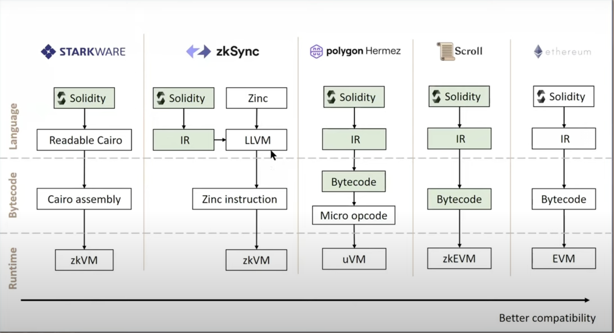

# 区块链

## 1、Polygon
### 1.1、介绍
+ 基于pos的以太坊侧链技术框架
+ MATIC代币
+ 印度，19年开始

github: https://github.com/maticnetwork/  


## 2、以太坊
### 2.1、分片与Layer2
1、解决以太坊交易性能问题  
以太坊分片是在以太坊内部进行扩容的性能解决方案，而Layer 2则是在以太坊区块链外部进行扩容的方案  

参考：https://zhuanlan.zhihu.com/p/342753841  
### 2.2、Layer1与Layer2
以太坊公链就是Layer1
Layer2相关技术：
+ plasma 返回交易结果
+ rollup 同时返回交易结果和交易的信息（压缩）
    - 错误性证明（Fraud Proof）
+ ZK-rollup 零知识证明
    - 有效性证明（Validity Proof）

代表性的layer2:
+ Arbitrum
+ Optimism
+ Polygon（项目选型）
+ zkSync

#### 2.2.1、layer2出现的目的  
太坊公链的工作效率低下，把一些以太坊上的交易移到Layer 2上去处理，处理完成以后再把结果返回给Layer 1，这样layer 1就没这么忙了。  

## 3、Solana链
### 3.1、介绍  
+ 2017年瑞士  
+ 公链
+ sol代币
+ defi项目多

## 4、支付
### 4.1 cpay
https://www.cpay.finance/


## 5、nft
### 5.1 opensea
nft交易平台

nft: 无聊猿  
https://ipfs.io/ipfs/QmRRPWG96cmgTn2qSzjwr2qvfNEuhunv6FNeMFGa9bx6mQ  


## 6、区块链知识
### 6.1、MEV（侧重收益）
MEV（最大交易价值）是指在区块链上的交易顺序可以对参与者产生经济影响的现象

概念参考文章：
https://learnblockchain.cn/article/5810  
https://www.bitpush.news/articles/4037081  mev攻击与解决方案  

https://www.techflowpost.com/article/detail_12034.html  suave工作原理  


### 6.2、rollup（侧重吞吐与效率）

基于Layer2进行扩容，进行数据扩容和降低了gas费用  

l2项目排名网站：https://l2beat.com/  


#### 6.2.1、ZK-Rollup零知识证明

简单理解就是在链上发布一个proof，即验证椭圆曲线的一个点  
eg:  
  1000个交易利用零知识证明精简为一条交易在链上执行


+ zkevm
  - 没有zkevm时，每个个合约都需要生成一个证明去证明自己的不能跨合约，
  zkevm所有的都可以放在zkevm和evm一样可以执行所有的  



##### 6.2.1.1、项目：  
+ https://github.com/0xPolygonHermez/zkevm-node（polygon zkevm）

#### 6.2.2、Optimistic Rollup乐观

简单理解编译成合约字节码，验证部分内容

+ Arbitrum 
介绍：https://huobiresearch.medium.com/%E4%B8%80%E6%96%87%E8%AF%BB%E6%87%82%E4%BB%A5%E5%A4%AA%E5%9D%8A%E4%BA%8C%E5%B1%82%E9%A1%B9%E7%9B%AEarbitrum-d9fdc658b1f3  

https://learnblockchain.cn/article/2665  


## 7、跨链
### 7.1、cosmos-sdk
底层Tendermint，最新切换到cometbft

### 7.2、项目
+ https://github.com/evmos/ethermint  （cosmos+evm实现）


## 8、sdk中用到的加密知识  
### 8.1、加密算法  
非对称加密：ed25519、sm2  
对称加密：AES  
原理：  
国密签名和验签：https://learnblockchain.cn/article/1507  
库：  
github.com/ZZMarquis/gm  国密库，签名实际为r+ s 64个字节长度  
crypto/ed25519     标准库生成的私钥实际为私钥+公钥   私钥和公钥都为32字节长度   

### 8.2、hash算法
SM3 sha256  

### 8.3、助记词
bip32、bip44、bip39  
原理：
https://learnblockchain.cn/2018/09/28/hdwallet/#%E5%8A%A9%E8%AE%B0%E8%AF%8D%E6%8E%A8%E5%AF%BC%E5%87%BA%E7%A7%8D%E5%AD%90
库：  
github.com/tyler-smith/go-bip32  
github.com/tyler-smith/go-bip39  


## 9、bitcoin

+ 比特币全节点下载
  - https://bitcoincore.org/en/download/

+ 查看比特币容量大小
  - https://blockchain.com/explorer  

+ 比特币钱包
  - https://bitcoin.org/

+ 测试网络水龙头
  - https://coinfaucet.eu/en/btc-testnet/
  - https://signetfaucet.com/  signet网络的

```text
signet=1
#testnet=1
txindex=1
#testnet=1

[test]
#server=1
#rpcuser=user
#rpcpassword=password
#rpcallowip=127.0.0.1
#rpcport=8332

[signet]
server=1
rpcuser=user
rpcpassword=password
rpcallowip=0.0.0.0/0
rpcport=8332
```


### 9.1、隔离见证SegWit
对比特币进行软分叉，及对原来的块进行扩容

原来只能存储1M，扩容后最大可以存储4M，后面可以进行nft存储，一个图片可以在4M以内

### 9.2、闪电网络
就是bitcoin二层网络
+ peer
+ channel

peer之前的通过channel进行转账，最后将交易回传到比特币主网，即闪电网络中进行多笔交易，将最后的结果回传到主网即一笔交易

### 9.3、nft--Ordinals
1btc=10^8sat 聪

+ 对sat进行排序
+ 存储格式Taproot


交易代码：https://github.com/VincentDebug/go-ord-tx  


PSBT可以实现去中心化markplace


### 9.4、brc-20
brc20是借助ordinals协议铭刻json数据，只定义了部署、铸造和转账行为
brc20代币的持有状态由链下维护
```text
{  
"p": "brc-20",//Protocol: 帮助线下的记账系统识别和处理brc-20事件  
"op": "deploy",//op 操作: 事件类型 (Deploy, Mint, Transfer)  
"tick": "ordi", //Ticker: brc-20代币的标识符，长度为4个字母（可以是emoji） 
"max": "21000000",//Max supply: brc-20代币的最大供应量  
"lim": "1000"//Mint limit: 每次brc-20代币铸造量的限制}
```

需要一些indexer去支持，目前都是自己实现，官方没有  
参考：https://github.com/unisat-wallet/libbrc20-indexer  


### 9.5、bitvm


### 9.6、rgb


## 学习资料
+ 区块链相关视频教程 https://github.com/biquanlibai/blockchain-course

