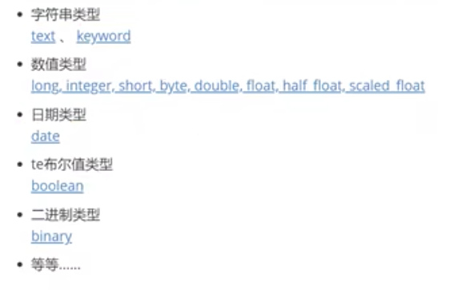

### es基础知识

### 基础知识
es--->mysql
* 索引--->数据库  
* 类型--->表，6.x在使用, 7.x淡化，8.x废弃  
* 类型--->数据库类型，varchar  
* 行--->文档
* 倒序索引

### 插件
* head 图形化界面(Kibana更好用，elk)
* ik分词器
    + ik_smart 最少切分
    + ik_max_word 最小颗粒度划分
    + ik分词器增加自己的字典,即自己的单词  
        在plugins-ik-config-*.dc

### 类型

