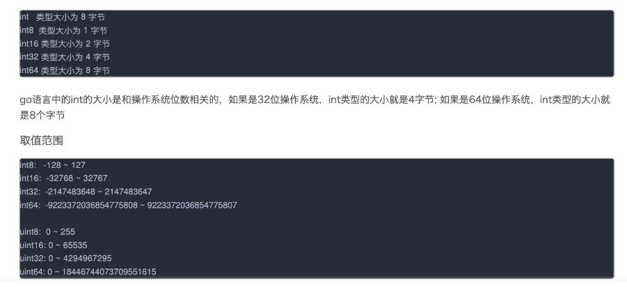
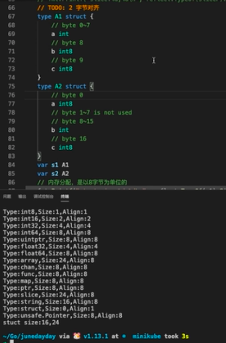
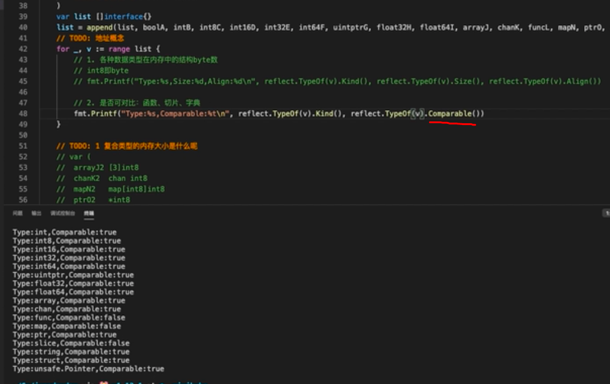
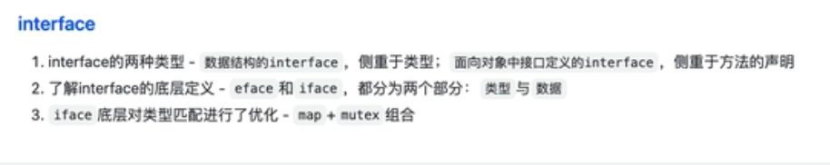
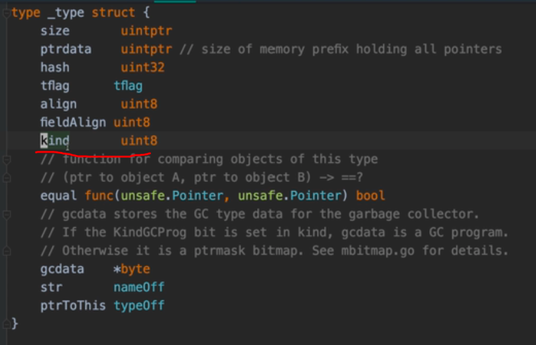
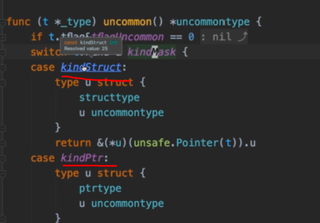
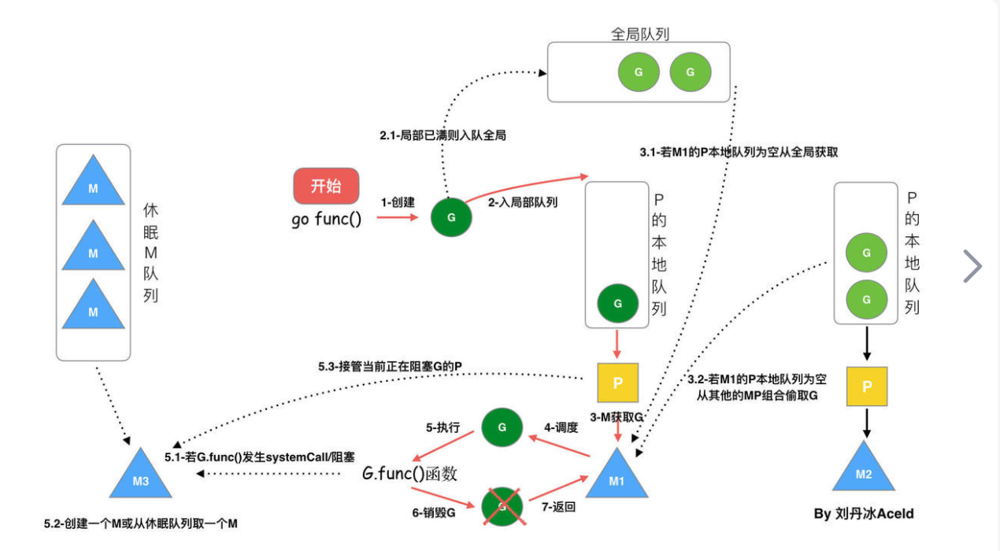
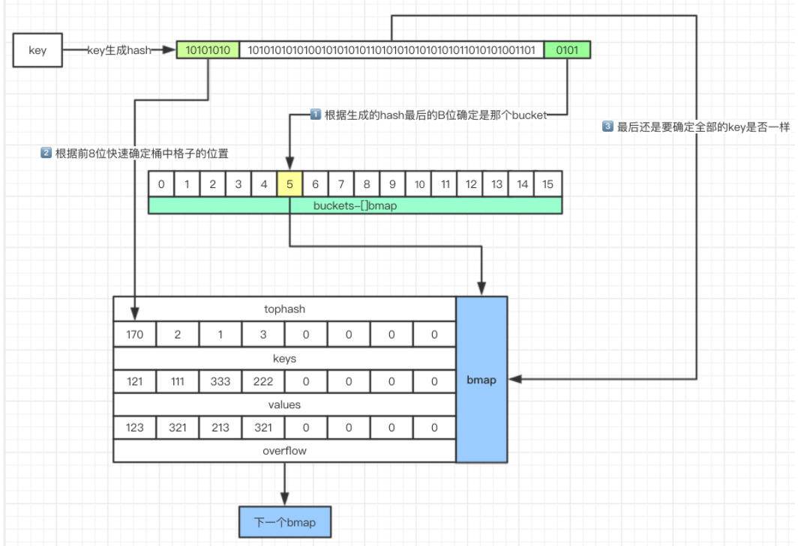
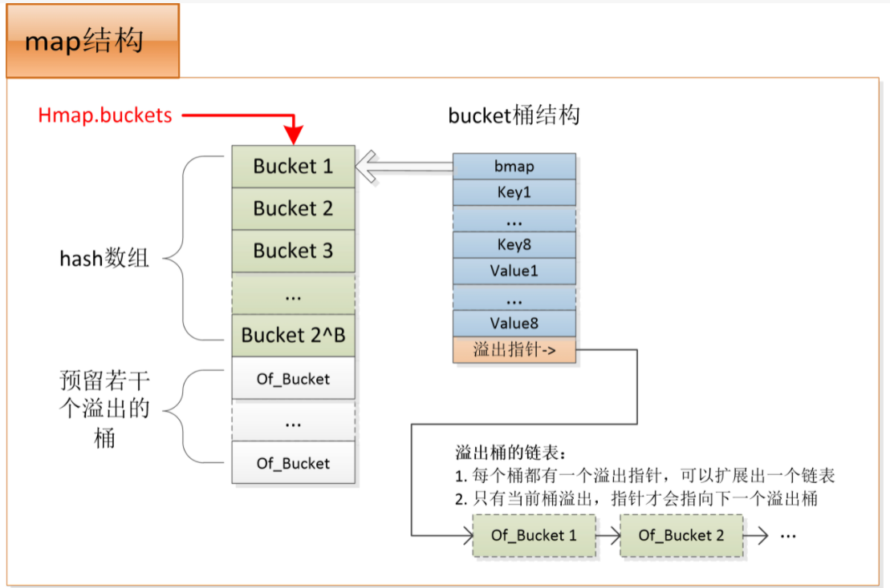

# go

## 一、基础知识

### 1.1 语法
```text
1. %v    只输出所有的值
2. %+v 先输出字段类型，再输出该字段的值
3. %#v 先输出结构体名字值，再输出结构体（字段类型+字段的值）

```

### 1.2 类型
#### 1.2.1 单位
+ 比特（位）：计算机存储信息的最小单位，称之为位（bit），音译比特，二进制的一个“0”或一个“1”叫一位
+ 字节：计算机存储容量基本单位是字节（Byte），音译为拜特，8个二进制位组成1个字节，一个标准英文字母占一个字节位置，一个标准汉字占二个字节位置

> 1字节 = 8位   1byte = 8bit

#### 1.2.1 int类型



### 1.3 并发

#### 1.3.1、进程、线程、协程

> 进程是程序在操作系统中的一次执行过程，系统进行调度和分配资源的一个独立单位

> 线程是进程的一个执行实体，是cpu调度和分派的基本单位，他比进程更小能独立运行的的基本单元

一个进程可以创建和撤销多个线程，同一个进程中的多个线程之间可以并发执行

> 协程，独立的栈空间、共享堆空间，调度由用户自己控制，本质上类似于用户级线程，这些用户级线程的调度也是自己实现
线程，一个线程可以跑多个协程，协程是轻量级的线程

#### 1.3.2、并发与并行

多线程程序在一个核的cpu上运行，就是并发  
多线程程序在多个核的cpu上运行, 就是并行  


### 1.4 问题
#### 1.4.1 判断chan是否关闭

```text
b, ok := <-ch
写已经关闭的chan会panic
```

#### 1.4.2. 地址空间存储

结论：A1比A2更省空间

#### 1.4.3. 类型比较

结论：func slice map 是地址不能进行比较
引用类型：slice map chan  
chan可以进行比较， why?

### 1.5 interface


runtime/iface.go   func convT2E 与func convT2I
+ iface（更复杂）  
  接口相关封装
+ eface  
  泛型相关封装  

26种数据类型




### 1.6. GPM调度器
#### 1.6.1 csp通讯顺序进程
将两个并发执行的实体通过通道channel连接起来，所有的消息都通过channel传输

#### 1.6.2 GPM


### 1.7 defer执行顺序
+ 1.return之后执行defer。
+ 2.defer是按照栈的顺序执行，先进后出。
+ 3.panic之后执行defer。
+ 4.panic会中断流程，panic之后的逻辑不会运行。
+ 5.如果不想影响主流程的逻辑应该在函数方法中recover。  

参考： https://blog.csdn.net/qq_15115793/article/details/108074042

### 1.8 Golang中汉字处理
每个中文字，占3个byte
```text
str1 := "Hello,世界"  
fmt.Println(len(str1)) // 打印结果：12
```

### 1.9 sync.one原理
https://zhuanlan.zhihu.com/p/261988561

实现原理：
type Once struct { 
    done uint32 //标志位
    m Mutex //保证原子操作
}
通过标志位来判断是否执行过，未执行就加锁执行函数调用，并将标志位置为1

自己如何实现：
通过channel来实现
//构造一个有缓冲的通道，防止deadlock错误
 ch := make(chan int,1)
//在channel发送一个数字1作为标志位
 ch <- 1

### 1.10 map底层原理
https://blog.csdn.net/luolianxi/article/details/105371079
map是由数组+链表实现的HashTable





### 1.11 slice底层原理及其扩容
扩容容量的选择遵循以下规则：
如果原Slice容量小于1024，则新Slice容量将扩大为原来的2倍
如果原Slice容量大于等于1024，则新Slice容量将扩大为原来的1.25倍
使用append()向Slice添加一个元素的实现步骤如下：
假如Slice容量够用，则将新元素追加进去，Slice.len++，返回原Slice
原Slice容量不够，则将Slice先扩容，扩容后得到新Slice;将新元素追加进新Slice，Slice.len++，返回新的Slice。


---
## golang规范
### 1、命名规范
+ 包命名：package  
保持package的名字和目录保持一致，尽量采取有意义的包名，简短，有意义，尽量和标准库不要冲突。包名应该为小写单词，不要使用下划线或者混合大小写。
+ 文件命名  
尽量采取有意义的文件名，简短，有意义，应该为小写单词，使用下划线分隔各个单词。
非单元测试文件不要以_test结尾，go编译器默认x_test.go为单元测试文件，不会进行编译。
+ 变量命令  
采用驼峰法，通过首字母大小写来控制是否包外可见 
+ 接口命名  
  - 单个函数的接口名以"er"作为后缀，例如type Reader interface {…}  
  - 两个函数的接口名综合两个函数名，例如type WriteFlusher interface {…}  
  - 三个以上函数的接口名，类似于结构体名，例如type Car interface {…}  
  - 特殊名词的首字母缩写需要按照规范来，例如URLProxy或者urlProxy不要命名为UrlProxy。

+ 变量名  
给常量变量命名时，遵循以下原则
  - 使用驼峰命名
  - 力求准确表达出变量的意思，不能使用无行业经验的单个字母命名的变量
  - 对于约定俗成的常量或者变量名，可以全部大写，比如GET、PUT、DELETE等
  - 不能使用特殊符号如$、_等  
