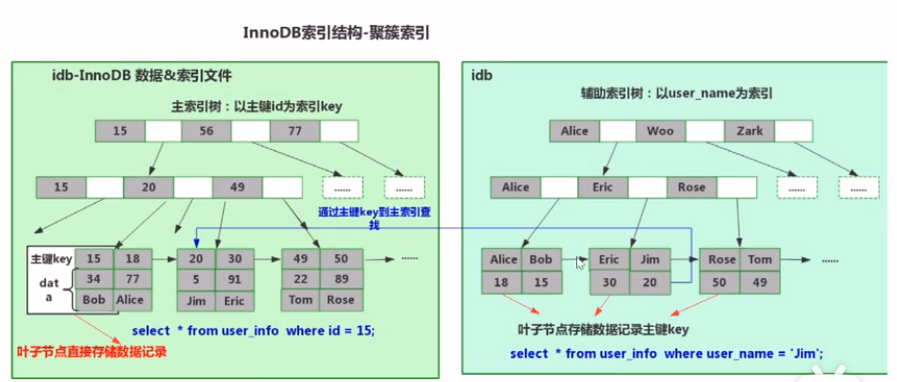
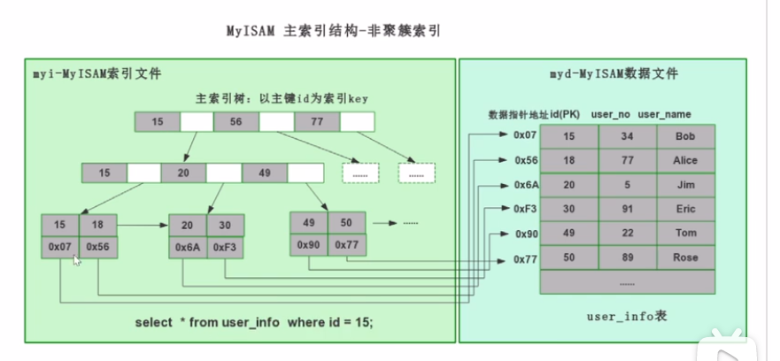
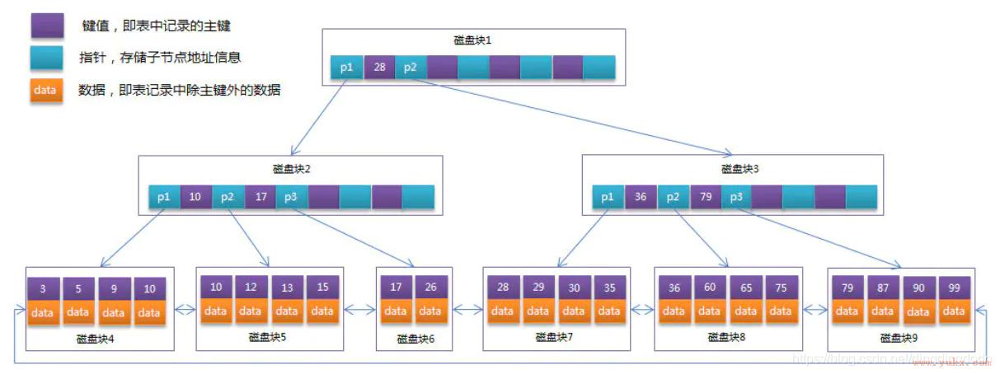
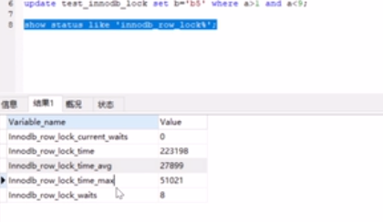

# mysql

## 一、安装

## 1.1. docker运行

```text
docker run -d  --name mysql \
-v ~/code/docker/mysql/data:/var/lib/mysql \
-v ~/code/docker/mysql/conf:/etc/mysql \
-v ~/code/docker/mysql/log:/var/log/mysql \
-p 3306:3306 \
-e TZ=Asia/Shanghai \
-e MYSQL_ROOT_PASSWORD=123456 \
mysql:5.7
```

```text
docker run -d  --name mysql \
-v ~/code/docker/mysql8:/var/lib/mysql \
-p 3306:3306 \
-e TZ=Asia/Shanghai \
-e MYSQL_ROOT_PASSWORD=123456 \
mysql:8.0
```

## 二、原理
### 2.1 ACID
原子性 （undo log）、一致性、隔离性、持久性 (redo log)  


### 2.2 事务
#### 2.2.1 事务自动开启和关闭
```shell
mysql> SHOW VARIABLES LIKE 'autocommit';

+---------------+-------+
| Variable_name | Value |
+---------------+-------+
| autocommit    | ON    |
+---------------+-------+

1 row in set, 1 warning (0.04 sec)
SET autocommit = 0|1|ON|OFF;
```

#### 2.2.2 事务级别

| 事务隔离级别                             | 脏读 | 不可重复读 | 幻读 |
|------------------------------------------|------|------------|------|
| 读未提交<br />（read-uncommitted）       | 是   | 是         | 是   |
| 不可重复读<br />（read-committed）oracle | 否   | 是         | 是   |
| 可重复读<br />（repeatable-read）mysql   | 否   | 否         | 是   |
| 串行化<br />（serializable）             | 否   | 否         | 否   |


数据库默认级别：可重复读，会产生幻读，什么是幻读：第一次读出来的是1-5行，再次读读出来的是1-6行


+ 脏读:  
在事务A执行过程中，事务A对数据资源进行了修改，事务B读取了事务A修改后的数据
+ 幻读:  
事务A 按照一定条件进行数据读取， 期间事务B 插入了相同搜索条件的新数据，事务A再次按照原先条件进行读取时，发现了事务B 新插入的数据 称为幻读
+ 不可重复读:  
如果事务A 按一定条件搜索， 期间事务B 删除了符合条件的某一条数据，导致事务A 再次读取时数据少了一条。这种情况归为 不可重复读
+ 快照读:  
快照读就是读取数据的时候会根据一定规则读取事务可见版本的数据。
+ 当前读:  
当前读就是读取最新版本的数据。
+ 串行化:  
  事务A和事务B同时操作数据时，如果事务A修改了数据，没有提交数据时，事务B想增加、修改、删除数据，都必须等待事务A提交，事务B才能执行

> 不可重复读针对的是修改，幻读针对的是新增或删除
> 不可重复读指的是两次读取过来的数据内容不一样，幻读指的是两次读取过来的数据条数不一样

### 2.3 索引
#### 2.3.1 类型
索引类型：主键索引、唯一索引、普通索引、组合索引、全文索引 
+ 索引失效
联合索引  
最佳左前缀法则  
失效的案例：  
A > 1 and B = 1   失效，改成a=1就满足最左前缀法则  
%like% 不走索引  


+ 什么是覆盖索引？  
Select 中使用的索引和where中使用的索引是一致的  
两个缺点：  
  - a)	select索引被where覆盖掉了  
  - b)	传输数据时浪费不必要的性能  

文件内排序
开辟了一个新的内存空间，将数据拷贝过去重新排序

#### 2.3.2 索引查询  
Innodb(聚簇索引)  
MyIsam(非聚簇索引)  

聚簇索引：将索引和数据放在了一起（理解主键索引）  
没有主键索引会生成一个默认的非空索引，或gen_clust_index隐式聚簇索引  





#### 2.3.3 B树和B+树的区别
+ (1) B+树改进了B树, 让内结点只作索引使用, 去掉了其中指向data record的指针, 使得每个结点中能够存放更多的key, 因此能有更大的出度. 这有什么用? 这样就意味着存放同样多的key, 树的层高能进一步被压缩, 使得检索的时间更短. 
+ (2)当然了,由于底部的叶子结点是链表形式, 因此也可以实现更方便的顺序遍历, 但是这是比较次要的, 最主要的的还是第(1)点



#### 2.2.4 MVCC
MVCC： 版本控制  
MVCC 就InnoDB 秒级建立数据快照的能力  
提高并发读写性能，不用加锁就能让多个事务并发读写  

Undolog  
Readview 判断版本链中哪个版本可用  

为什么解决了幻读？  
mvcc为快照读，多个select读的readview都是同一个的，所以不存在幻读  
当前读使用的是间隙锁，锁住一段时间范围  
Innodb默认使用的是可重复读，并且是默认开启间隙锁的  

### 2.3 锁
+ 行锁：  
A事务操作时未提交，此时一个sql来操作这个数据会阻塞，A commit后阻塞的sql会执行成功
+ 表锁：  
索引失效，行锁会升级为表锁
间隙锁：
Id 1 3 5 缺少2 4 6间隙，间隙锁一般发生在范围查找中

查看锁的状态



# 资料
+ 客户端工具：dbeaver

