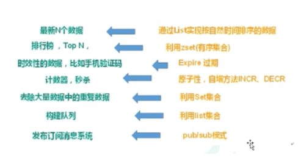

# redis知识

## 安装
### 1.docker
```shell
docker run -d --name redis6 -p 6379:6379 redis:6.0
```

## 一、 基础
### 1.1. 基本数据类型
string、hash、list、set、zset


### 1.2. 缓存击穿（cache无db有）
#### 1.2.1. 描述
key对应的数据存在，但在redis中过期，此时若有大量并发请求过来，这些请求发现缓存过期一般都会从后端DB加载数据并回设到缓存，这个时候大并发的请求可能会瞬间把后端DB压垮。
#### 1.2.2. 解决方案
key可能会在某些时间点被超高并发地访问（有可能是缓存失效或者无缓存）
+ 设置key的过期时间随机
在像redis批量设置key的时候尽量做到过期时间的随机性，以此避免某一时间会有批量key过期导致的缓存击穿
优缺点：虽然解决了缓存中同一时间批量key过期导致的击穿问题但是并不能解决缓存中压根就不存在key而造成的击穿
+ 使用互斥锁（分布式锁）
在查询数据库的时候加一个分布式锁，使得某一特定时间内只有一个请求访问数据库，访问成功后将查询到的值缓存近redis，这样在下次访问时就不会造成击穿的现象了。
缺点：增加了加锁的成本
+ 热点key永不过期
针对热点key批量过期造成的穿透问题，将key设置成永不过期就能解决
缺点：只能解决key过期造成的击穿不能解决缓存中没有key造成的击穿，并且热点key的确认也是门学问，并不总能保证设置的热点key不遗漏

### 1.3. 缓存穿透（cache无db无）
#### 1.3.1. 描述
key对应的数据在数据源并不存在，每次针对此key的请求从缓存获取不到，请求都会到数据源，从而可能压垮数据源。比如用一个不存在的用户id获取用户信息，不论缓存还是数据库都没有，若黑客利用此漏洞进行攻击可能压垮数据库。
#### 1.3.2. 解决方案
+ 布隆过滤器
将所有可能存在的数据哈希到一个足够大的bitmap中，一个一定不存在的数据会被 这个bitmap拦截掉，从而避免了对底层存储系统的查询压力。
优点：布隆过滤器底层通过redis的bitMap实现是基于位的操作，所以效率高。
缺点：需要提前将key存入过滤器，这大大增加了前置成本，hash会出现碰撞。
+ key-null
如果一个查询返回的数据为空（不管是数据不存在，还是系统故障），我们仍然把这个空结果进行缓存，但它的过期时间会很短，最长不超过五分钟。
优点：操作简单
缺点：redis里有过多的垃圾数据，浪费了内存空间
+ 前置判断
查询前在接口层做权限、逻辑校验，尽可能多的判断key的合法性
优点：使用成本低，所以建议只做附加的解决方案使用
缺点：但并不足以规避掉缓存穿透的风险

### 1.4. 缓存雪崩（cache全无db有）
#### 1.4.1. 描述
当缓存服务器重启或者大量缓存集中在某一个时间段失效，这样在失效的时候，也会给后端系统(比如DB)带来很大压力。
#### 1.4.2. 解决方案
+ 缓存失效时间分散开
比如我们可以在原有的失效时间基础上增加一个随机值，比如1-5分钟随机，这样每一个缓存的过期时间的重复率就会降低，就很难引发集体失效的事件。
+ 设置锁（与缓存击穿锁类似）
从缓存访问key开始就加锁，当缓存没有则去数据库查，查晚塞入缓存最后释放锁；如果是单机应用则直接加虚拟机锁，集群部署的话则需使用分布式锁


---
+ redis 数据类型  
redis 常用数据类型，以及使用场景等等。各数据类型的底层数据结构是什么？比如 zset 底层实现是跳跃表 (skiplist)，讲讲 skiplist 为什么这么快。
+ redis 的架构 （必问）  
这个一般问的是 redis 为什么这么快，除了基于内存操作，还有什么其他原因。redis 是单线程还是多线程？那部分是单线程，那部分是多线程？redis 的线程模型（这个问题贼爱问）。
+ redis 内存持久化  
为什么要持久化？持久化机制、持久化方式是什么，各有什么优缺点。怎么选择合适的持久化方式，有没有了解过混合持久化？
+ redis 内存淘汰策略
+ redis 事务和管道  
这个大概说说就行了，区别不太大，一个是在客户端打包，一个是在服务端打包而已。
+ redis 的集群方案 （高频点）  
这个最爱问了，主从，哨兵，分片（分为客户端和服务端分片）。
+ 缓存异常解决  
缓存穿透、缓存击穿、缓存雪崩解决方式。
+ 缓存一致性  
怎么保证 redis 和 mysql 的数据一致性，这个各抒己见吧，可以看看 B 站的毛剑有次的分享，专门讲了怎么解决缓存一致性的问题。
+ 杂项  
一个高并发项目，所以一般爱问分布式锁的实现，还有 redis 的队列和专业的 mq 区别，有没有了解 redis 的 red lock 以及 redis 的 stream 能不能作为专业的 mq，为什么？大批量的删除 redis 中的 key，会有什么问题，怎么解决？redis 怎么实现延时队列，怎么实现异步队列。布隆过滤器了解过吗？

---