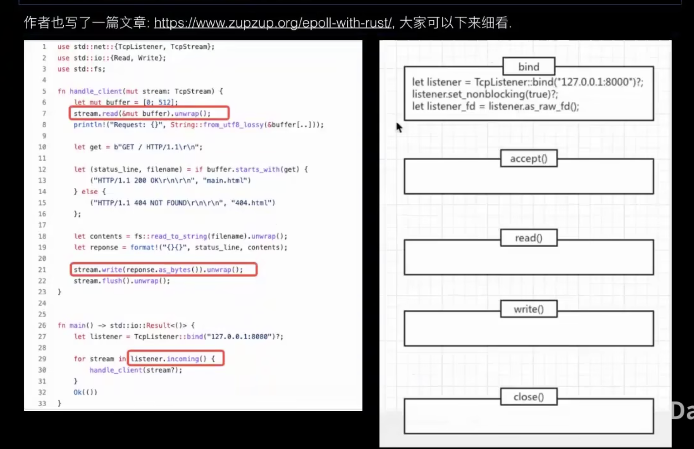

# rust

## 1 安装
### 1.1 安装
windows下安装
```text
https://www.rust-lang.org/zh-CN/tools/install
```

linux/mac下安装rust和cargo
```shell
curl --proto '=https' --tlsv1.2 -sSf https://sh.rustup.rs | sh
```

### 1.2 升级
+ 升级到稳定版本  
```shell
rustup update stable
```

+ 安装其他版本
```text
rustup install 1.30.0
```

+ 切换特定版本
```text
rustup override set 1.52.0
```

## 2 基础语法
cargo install xx --locked 安装时会根据Cargo.lock中的版本而不是Cargo.toml中的版本
### 2.1  ->
return 数据类型

### 2.2  : 
类型注解  
let x: i32 = 42;  

### 2.3  ::
路径分隔符  
MyModule::MyType  

### 2.4  Option<ID>
Option<ID>代表一个可选的ID类型的值，其取值可以是Some(id)或None  

### 2.5  b""
b"" 表示一个空的字节数组，常常用于表示二进制数据或 ASCII 码  

### 2.6  ()
() 表示 Rust 中的单元类型，也被称为 unit 类型。它类似于其他编程语言中的 void 类型，表示“没有值”的概念


### 2.7 宏macor
+ 声明宏
  - vec! println!
+ 过程宏
  - 自定义派生（derive）
  - 类属性
  - 类函数

要理解宏，需要知道rust的编译过程https://www.cnblogs.com/gaozejie/p/16950786.html  

```rust
#[derive(Debug, Default)]   // Default作用 类型有默认初始化值，即golang中零值

// 从 &str 类型到 XXX 类型的转换更加方便
impl From<&str> for XXX {}

// 是一个属性（Attribute），用于告知编译器允许存在未使用的代码
#[allow(dead_code)] 

// PartialEq trait 用于比较两个值是否相等，通常用于测试和数据处理过程中的判断
// Eq 是 PartialEq 的一个子trait，它没有提供额外的方法，而是要求类型必须能够实现 PartialEq 并满足更强的条件
#[drive(Debug, PartialEq)] 
assert_eq!(person1, person2);
```


### 2.8 所有权
理解变量在堆栈上分配以及copy和move  

```text
#[derive(Debug, Clone, Copy)]
struct A {
    a: i32,
    b: i32
}
fn main() {
    let a = A {a: 10, b:20};
    let b: A = a;
    println!("{:?}", a);

}
```
struct A 虽然内部成员a和b实现了copy trait但是直接println a会报错，显示move了，所以要显式的指出copy+clone的trait  


+ 解引用会获取所有权


### 2.9 类型
#### 2.9.1 指针
+ 普通指针---长度确定
  - &[u32; 5]
+ 胖指针---长度不确定
  - &[u32] 

#### 2.9.2 类型自动推导
```text
let s = "1";
// println!("{}",s.parse().unwrap()); // 错误，parse是泛型，无法知道是usize还是i32类型，无法自动推导需要指明
println!("{}",s.parse::<i32>().unwrap());
```

#### 2.9.3 trait
面向接口编程，定义和实现分开，实现解耦 ====》go中的interface


#### 2.9.4 类型转换
+ 基本数据类型转换 as
```text
struct S(i32);  // 元组结构体

trait A {
    fn test(&self, i: i32){
        println!("from trait A {:?}", i);
    }
}

trait B {
    fn test(&self, i: i32){
        println!("from trait B {:?}", i);
    }
}

impl A for S {}
impl B for S {}

fn main(){
    let s = S(1);
    // s.test(2); // 无法知道调用A还是B中test
    <S as A>::test(&s, 10);
    <S as B>::test(&s, 20);
}
```

### 2.10 错误处理
unwrap -> result/match -> 自定义错误（重写source）+ From转换  


#### 2.10.1 自定义错误
+ 实现impl std::fmt::Display的trait
+ 实现impl std::fmt::debug的trait，一般通过注解#[derive(Debug)]  
+ 实现impl std::err::Error


### 2.11 cargo包管理
目的：版本管理，为了解决依赖  

java --> meaven  
python --> pip  
nodejs --> npm 


+ cargo.toml
  - edition = "2021"   三年一个


#### 2.11.1 module

+ mod --> module.rs/modoule/mod.rs  
+ use --> 使模块路径在使用时变短
+ super --> 指向父级


### 2.12 测试
#### 2.12.1 单元测试
+ 启用多线程执行测试：  
cargo test RUNST_TEST_THREADS=1

+ #[ignore]
cargo test -- --ignore


+ #[should_panic]


#### 2.12.2 集成测试
集成测试位于被测试代码的外面  -- tests目录
目的：测试被测试代码的多个方法是否能一起正常工作  


#### 2.12.3 基准测试
+ #[bench]


#### 2.12.4 mock
https://github.com/asomers/mockall  


#### 2.12.5 模糊测试 fuzz
模糊测试用于通过提供随机数据作为输入来发现安全性和稳定性  
https://rust-fuzz.github.io/book/  


### 2.13 futures异步编程
async会阻塞整个线程，阻塞的future会让出线程控制权，允许其他future运行
 

#### 2.13.1 executor
用户态协程（future）依赖executor（负责协程的调试）  
哪些库有executor:
- futures库自带
- tokio 当使用#[tokio::main]时，就引用了tokio的executor
- async::std, 与tokio类似


#### 2.13.2 async/await
实现了类似多线程的效果，实际就是实现了futures，线程遇见阻塞时会先去执行其他的的当不阻塞的在继续执行  


### 2.13.3 tokio
一个异步运行时库  
 


#### 2.13.3.1 generator
与闭包的区别是有yield(暂停)  


### 2.13.4 mio 理解tokio
+ io多路复用  --> linux epoll


tcp理解


epoll实现tcp


+ 事件驱动reactor
+ 跨平台抽象examples-minimio


### 2.13.5 pin
钉住变量使其不能move，解决自引用问题，为异步而生


### 2.14 wewb框架
+ rocket 早期 -->tokio
+ axum  -->tokio官方

#### 2.14.1 sql
+ sqlx


#### 2.14.2 压测工具
+ ab --> mac 命令  ab -n 100 -vc 10


### 2.15 动态库调用
+ ABI：是一种二进制接口标准
+ FFI：是一种从高级语言调用低级语言函数的机制


### 2.16 grpc
+ tonic

工具类似curl --> grpcurl


### 2.17 智能指针
Deref trait --> 拥有指针语义
Drop trait --> 拥有内存自动管理机制

智能指针：
1、可以自动解引用，提升开发体验
2、可以自动管理内存，安全无忧

+ Box
  - 栈上数据分配到堆上
+ Vec<T> | String
+ Cell | RefCell
  - 使用不变引用可以修改数据(rust同一时间只能有一个可变引用)
  - cell<T> T实现copy
  - RefCell 使编译可以通过，将错误推迟到运行时，比cell支持的数据更广
+ Rc | Arc
  - 引用计数
  - Rc单线程，Arc多线程
+ RwLock | Mutex


### 2.18 trait
+ 接口
+ 类型标记
+ 泛型限定
+ 抽象类型

+ 静态分发 --> 没有开销的抽象
+ 动态分发 --> 有运行时开销（寻址过程） dyn


+ eraly bound
+ late bound


## 3 编辑器
### 3.1 vscode
#### 3.1.插件
+ crates 包管理
+ rust-analyzer


## 4 链路追踪
### 4.1 库
+ https://github.com/tokio-rs/tracing
+ https://github.com/sile/rustracing
+ https://github.com/tikv/minitrace-rust

### 4.2 概念
+ trace tree --> 完整的调用过程，即：一次请求
+ span --> 一次rpc请求
+ tag --> key:value，每个span可以有多个tag
+ spanContext --> 边界，传递一些信息到下级span，比如（trace_id, span_id）


openTracing提供了一系列统一的接口规范（k8s的基金会）
  


### 4.3 jaeger
uber团队实现的开源的分布式追踪系统，基于openTracing标准
- golang实现


## 工具
+ tokei 统计代码


## 5 资料
### 5.1 书
+ https://course.rs/  
+ https://kaisery.github.io/trpl-zh-cn/ch06-03-if-let.html


