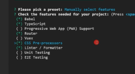

# vue3教程

## 一、安装

```text
1、安装淘宝镜像
npm install -g cnpm --registry=https://registry.npm.taobao.org

2、安装vue
npm install -g @vue/cli

3、创建项目
vue create vue3-demo

4、安装ui
npm install element-plus --save

5、安装网络库
npm install axios
```


## 二、语法
```text
1、vbase快捷插件
Vue VSCode Snippets
```

