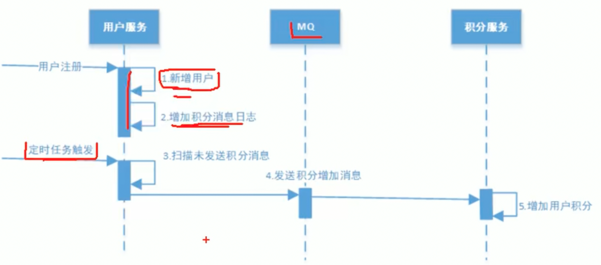
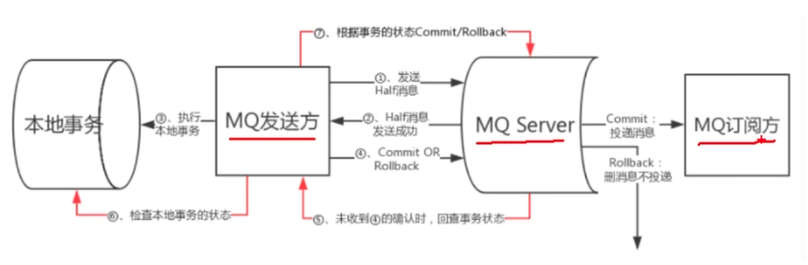
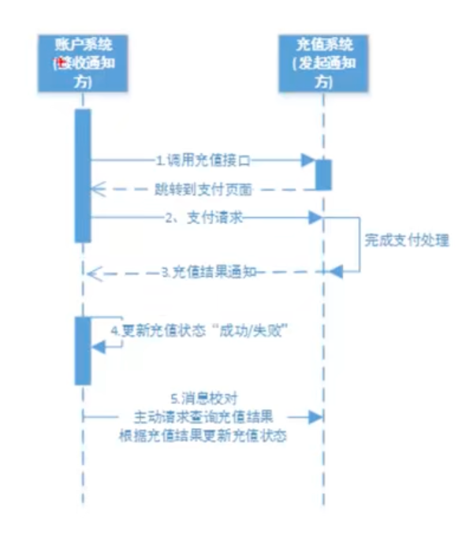

# 分布式

## 一、分布式锁
参考：https://www.cnblogs.com/liuqingzheng/p/11080501.html  

> 和分布式事务一样最终是保证数据的一致性

+ 基于redis轮询
+ 基于zookeeper与etcd的主动通知

## 二、分布式事务

参考： https://www.jianshu.com/p/d64045ed9012  

+ 2pc 
  * XA
  * seata
+ 本地消息表

+ mq本身支持事务消息

  rocketmq的事务消息

+ 最大努力通知
最大努力通知，尽最大重试时间将结果返回，如果通知不到，会提供一个查询接口
让用户自己查询

+ 补偿事务 tcc 三阶段提交

## 三、分布式算法
### 3.1 raft分布式算法
Etcd使用raft，为选举领导人进行共识的确认

## 四、区块链中使用的共识算法
公链：
+ pow ：比特币)基于工作量证明，挖矿，即：算出的hash值符合期望值
+ Pos ：基于权益，用户保持在线，根据手上持有的toke进行分红
+ DPOS: 选择100个出块节点，轮询出块，或者可以进行选举

其他的： PBFT、RAFT
