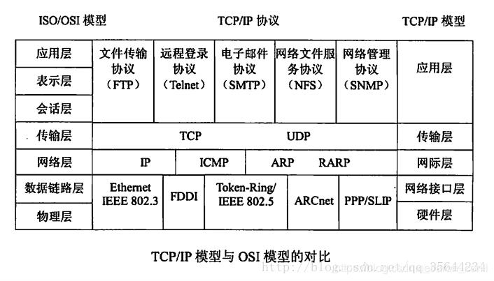
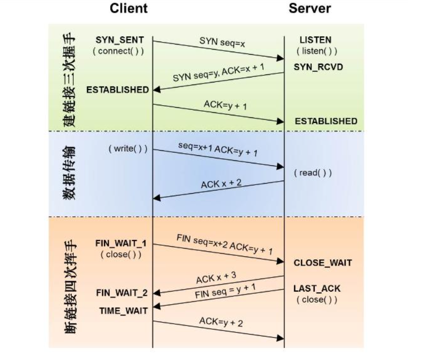
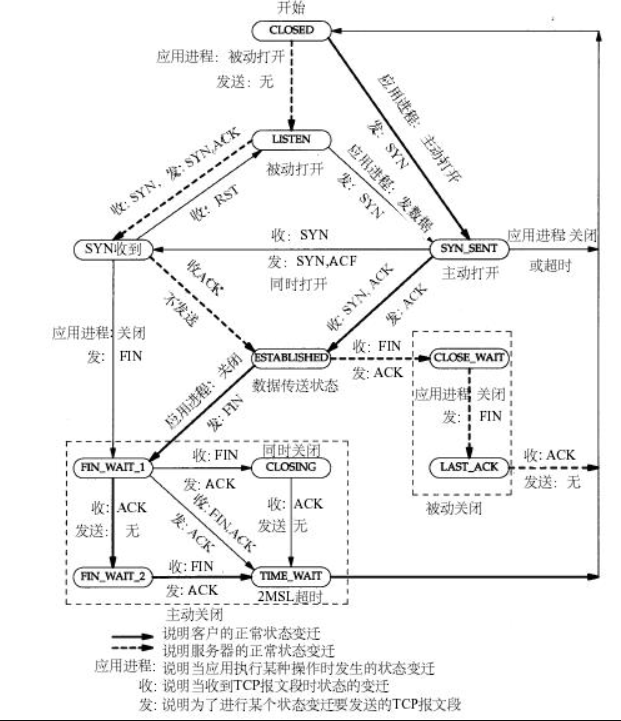
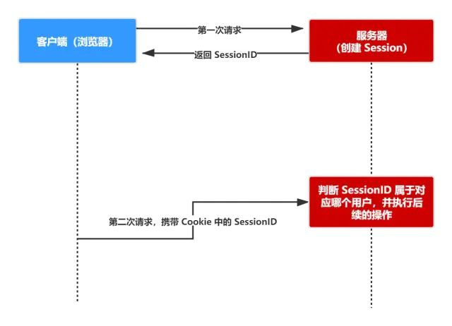
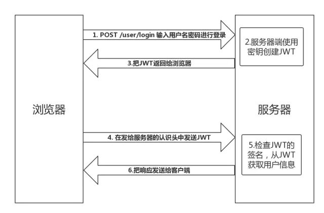

# 网络

## 一、基础知识
### 1.1. 多路复用
+ select  
select适合少量活跃连接，一般几千  
  - 每次调用select（）的时候，都必须要将fd从用户态转换成内核态
  - 单个进程能够监视的文件描述符的数量存在最大限制，通常是1024，当然可以更改数量，但由于select采用轮询的方式扫描文件描述符，文件描述符数量越多，性能越差
+ epoll  
epoll适合大量不太活跃的连接  
    - epoll在内核中会维护一个红黑树和一个双向链表，红黑树存放通添加进来的事件，双向链表存放就绪的事件

### 1.2. http状态码
400 bad request，请求报文存在语法错误  
401 unauthorized，表示发送的请求需要有通过 HTTP 认证的认证信息  
403 forbidden，表示对请求资源的访问被服务器拒绝  
404 not found，表示在服务器上没有找到请求的资源  

### 1.2. http状态码

### 1.3. TCP四次握手

### 1.4. Session与jwt

