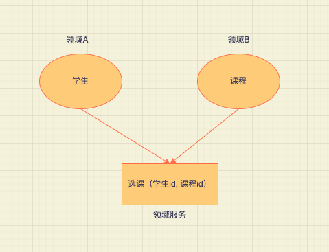
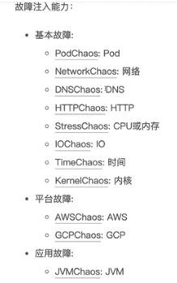
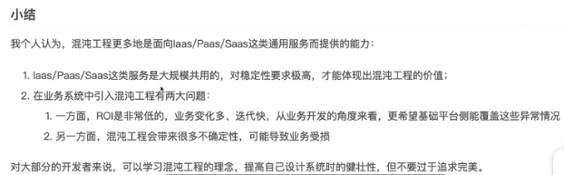
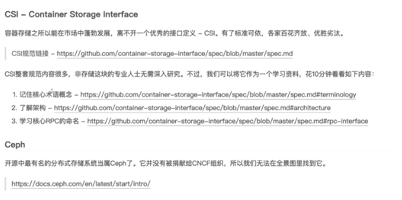
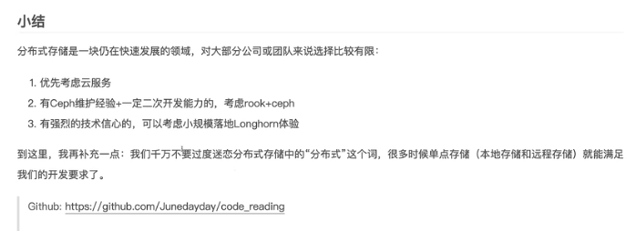

# 设计模式

## 一、DDD模型  
  领域驱动设计，基于边界的设计思想
### 1.1. 目标
  解决快速变化，复杂系统设计问题
### 1.2. 理解
  贫血模型对象内只有成员变量，充血模型可以有成员方法
+ 贫血模型
   是一种面向过程的编程模式  
   举例：mvc  
包：controller、service、dao  

+ 充血模型  
   数据和对应的业务逻辑被封装到同一个类中  
   业务逻辑集中在 Service 类中  
包：domain、service  

### 1.3. 总结
各领域内自治，可以实现自我发展

## 二、DDD模型 
### 2.1. CNCF项目
#### 2.1.1 混沌工程
ChaosMesh    故障注入

#### 2.1.2 云原生存储
Longhorn

